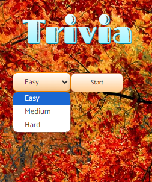

# Trivia App

Using Typescript React on Vite, I developed a Trivia app that you can choose different difficulty for the questions.

All the quesitions are from a free trivia api on this link: https://opentdb.com/api_config.php

The app keeping your score and after 10 questions it gives you the final score.

With a dropdwon list, You can choose the difficulty and start the Trvia.

This is the presentaion of the questions.

The App highliting wrong and correct answer after each selection.

